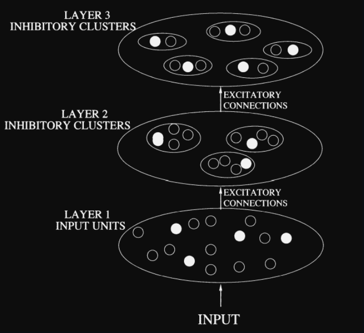

## About the COMPANN Neural Network

Introducing the COMPANN (Competitive Artificial Neural Network), a state-of-the-art machine learning solution meticulously designed and architected to leverage the power of competitive learning for advanced data clustering and pattern recognition tasks.

The COMPANN Neural Network is a multi-layered system composed of clusters of neurons, each with their unique set of weights and outputs. Its architecture is inspired by the biological neural networks found in the brain, contributing to the network's adaptive and efficient learning capabilities.

Scaled-down version:

## Innovative Design and Architecture

Each layer in the COMPANN Neural Network contains numerous clusters, with each cluster consisting of several neurons. The unique feature of the COMPANN lies in the competition among the neurons within each cluster during the activation process. This competition results in only one neuron (the "winner") having a non-zero output, mimicking the "winner-takes-all" nature of biological neural networks.

This competitive process ensures efficient resource allocation, as only the most relevant neurons are activated. It also encourages specialization among the neurons, improving the network's capacity to detect intricate patterns and subtle correlations within the data.

## Flexible and Robust Learning

The learning process in the COMPANN network involves the use of a gradient descent optimization algorithm that adapts the weights of each neuron based on the input and the desired output. This learning process is iterative, with the network improving its performance over time as it encounters more data.

The learning rate, a critical parameter in the network, can be easily adjusted to control the speed and stability of the learning process. With a higher learning rate, the network adapts rapidly to new data but may overlook subtle patterns. A lower learning rate allows the network to learn more gradually, potentially capturing more details but at the cost of increased computation time.

State-of-the-Art Pattern Recognition

COMPANN's robust learning approach enables it to recognize complex patterns within vast and diverse datasets. Whether you're dealing with image recognition tasks, natural language processing, or any other complex data analysis, COMPANN stands ready to uncover insights and facilitate data-driven decision making.

## Applications

The COMPANN neural network is suitable for a wide array of applications including but not limited to:

- Image and speech pattern recognition
- Natural Language Processing (NLP)
- Data classification and clustering
- Biomarker pattern detection
- Anomaly detection
- Recommender systems

Built on advanced computational models and the principles of competitive learning, COMPANN represents the next evolution in neural network technology, delivering unparalleled performance and flexibility for all your data analysis needs.